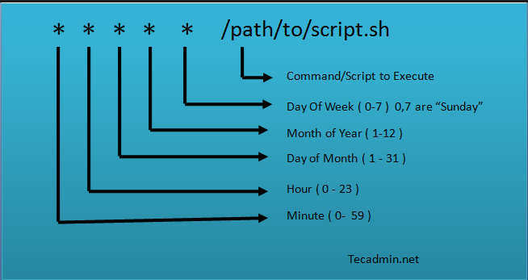

## cron是用来做任务调度的系统工具，通过守护进程cron使得任务可以按照固定的时间间隔在系统后台自动运行

### cron利用一个叫做cron表的文件，这个文件中存储了需要执行的脚本或者命令的调度列表以及执行时间


```bash
02 * * * * /root/test.sh   #

00 5,6,7 * * /root/test.sh

00 */12 * * 0 /root/test.sh

00 02 * * * /root/test.sh
```

### cron的组成说明



| 组成部分 | 含义 |
| ------ | ------ |
| 第一个 *  | 分钟 0-59 |
| 第二个 *  | 小时 0-23 |
| 第三个 *  | 日期 1-31 |
| 第四个 *  | 月份 1-12 |
| 第五个 *  | 工作日 0-6 |
| 命令      | 在指定时间执行的命令或脚本|

### 
- https://crontab.guru/


### 一行命令增加定时任务

```sh

line="59 23 * * * /bin/bash /home/ubuntu/test.sh" && (crontab -u ubuntu -l; echo "$line" ) | crontab -u ubuntu -
```
- 用户ubuntu替换为需要的用户